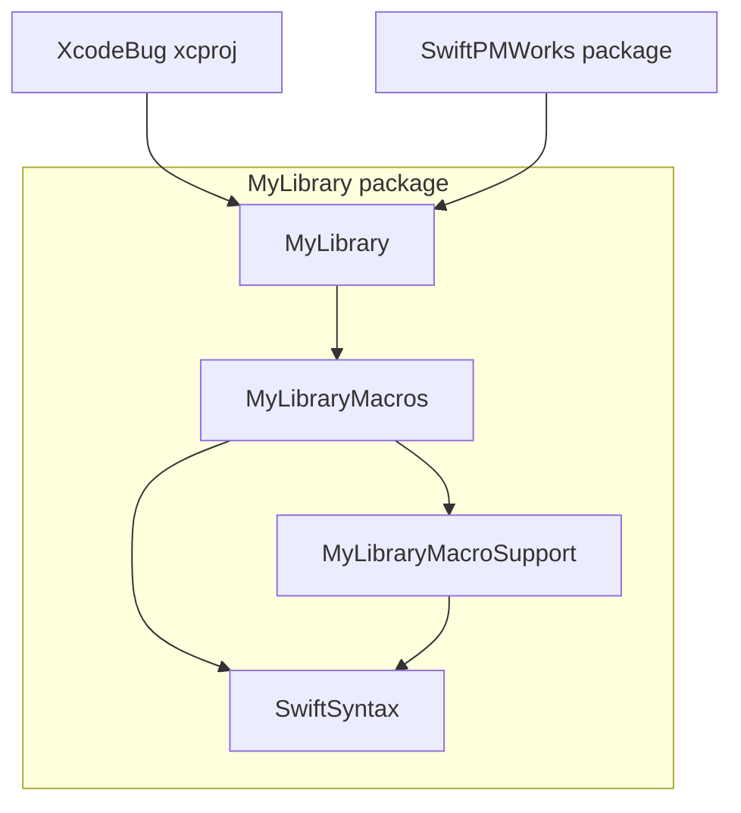

# FB25032548: Xcode SwiftSyntax prebuilts bug

In certain project set ups it's possible for Xcode to stop using SwiftSyntax prebuilts, whereas building directly with SwiftPM from the command line does properly use prebuilts.

The attached project contains such a project:




The project has a SwiftPM package (MyLibrary) that vends a library that has a macro, as well as a "macro support" library. This support library depends on SwiftSyntax but only macro targets depend on it, never regular targets, and the support library is critical for demonstrating the bug in Xcode. The Xcode project the depends on MyLibrary (but not the macro support) and building the Xcode project does not use prebuilts. You can verify this by building from the command line and seeing that SwiftSyntax is built from scratch:

```
xcodebuild \
  -scheme XcodeBug \
  -configuration Debug \
  -derivedDataPath /tmp/XcodeBugDerivedData build \
  -project XcodeBug.xcodeproj \
  clean build
```

The project contains another SwiftPM package called SwiftPMWorks to demonstrate that a similar set up using only SwiftPM does indeed work. To see that, build the package with:

```
cd SwiftPMWorks \
  && swift package clean \
  && swift build
```

…and see that it builds instantly without compiling SwiftSyntax.
